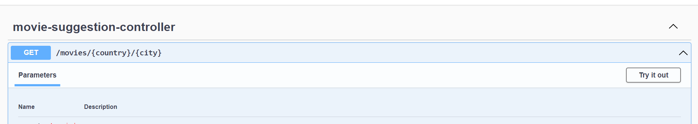
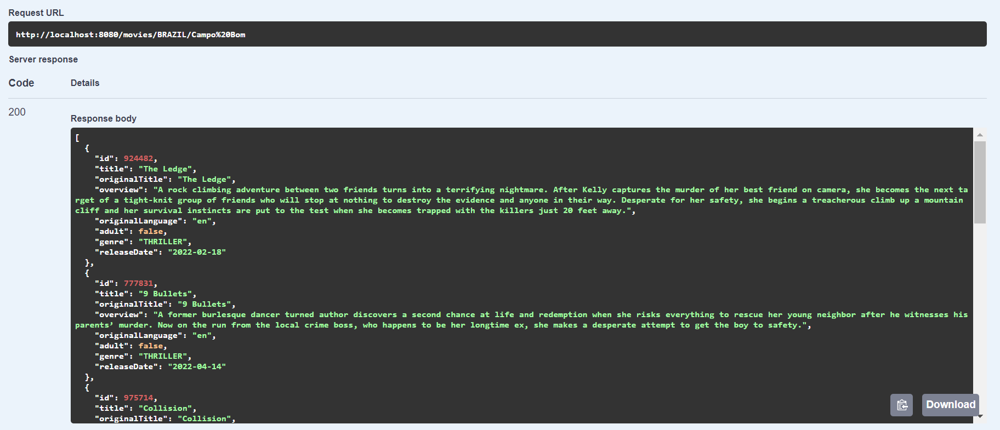
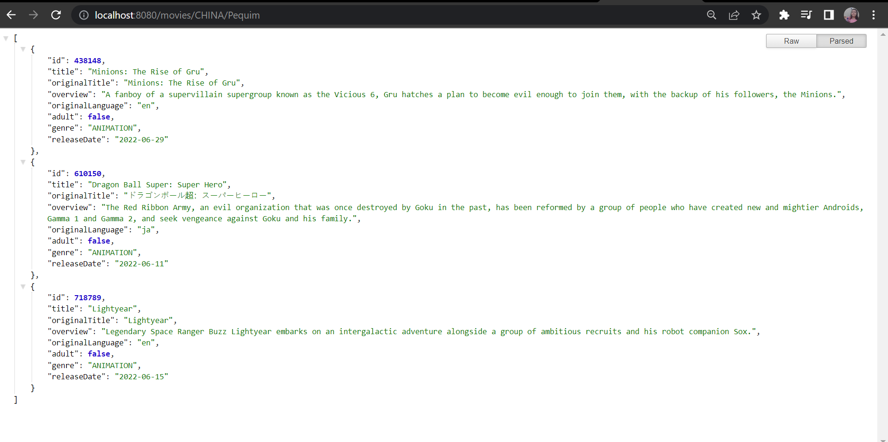

# MovieSuggestion API

It is an API developed with the purpose of recommending movies according to the temperature informed by the user!

## Prerequisites to run the application:
- Java v17
- Gradle v7.4.1

## Step by step to run the application:
* Clone the repository

```bash
$ git clone https://github.com/andressamorschel/MovieSuggestion.git
```

- In the root directory, run:
```bash
$ gradle bootrun
```

## Consuming the API
* In your browser's search bar, type:
```bash
$ http://localhost:8080/documentation.html
```
* You will be taken to the Open API interface, now click on the endpoint **GET/movies/{country}/{city}**, and then, **Try it out**
<p align="center">
  
</p>

* Now, just enter the desired location and click **execute**

* Example API response:

<p align="center">
  
</p>

* You can also make the request directly through the browser, typing the uri below and filling in the fields between curly braces:
```bash
$ http://localhost:8080/movies/{country}/{city}
```
* Browser request example:
<p align="center">
  
</p>

You can check the documentation <a href="https://app.swaggerhub.com/apis/ANDRESSAMORSCHEL_1/MovieSuggestion-api/v2">here</a>
