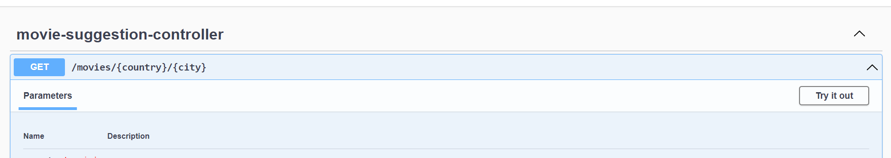
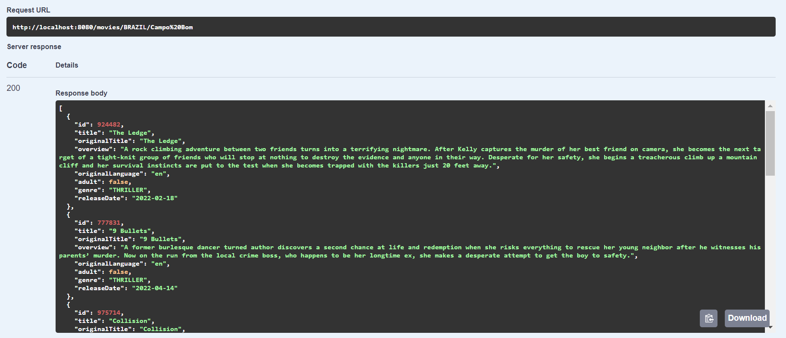

# MovieSuggestion

É uma API desenvolvida com o propósito de recomendar filmes de acordo com a temperatura informada pelo usuário!

## Pré requisitos pra rodar a aplicação:
- Java v17
- Gradle v7.4.1

## Passo a passo para rodar a aplicação:
* Clonar o repositório

```bash
$ git clone https://github.com/andressamorschel/MovieSuggestion.git
```

- No diretório raiz, rode:
```bash
$ gradle bootrun
```

## Consumindo a API:
* Na barra de pesquisa do google, digite:
```bash
$ http://localhost:8080/documentation.html
```
* Você será direcionado para a interface do Open API, agora, clique no endpoint **GET/movies/{country}/{city}**, e em seguida, **Try it out**
<p align="center">
  
</p>

* Agora, basta você inserir a localização desejada e clicar em **execute**

* Exemplo de resposta da API:

<p align="center">
  
</p>

* Você também pode fazer a requisição diretamente pelo navegador, digitando:
```bash
$ http://localhost:8080/movies/{país}/{cidade}
```
* Exemplo de requisição pelo navegador:
